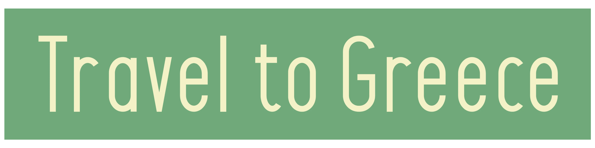

Travel to greece is a site aimed at those who want to go on holiday to Greece or one of its islands. The site wants to target those who want a personal trip that is based on the customer's wishes, therefore one trip is not the same as the other. 

On the site, you will see information about Travel to Greece and what they can offer, as well as advertising about the island of Karpathos, which is a travel destination that they have specialized in.

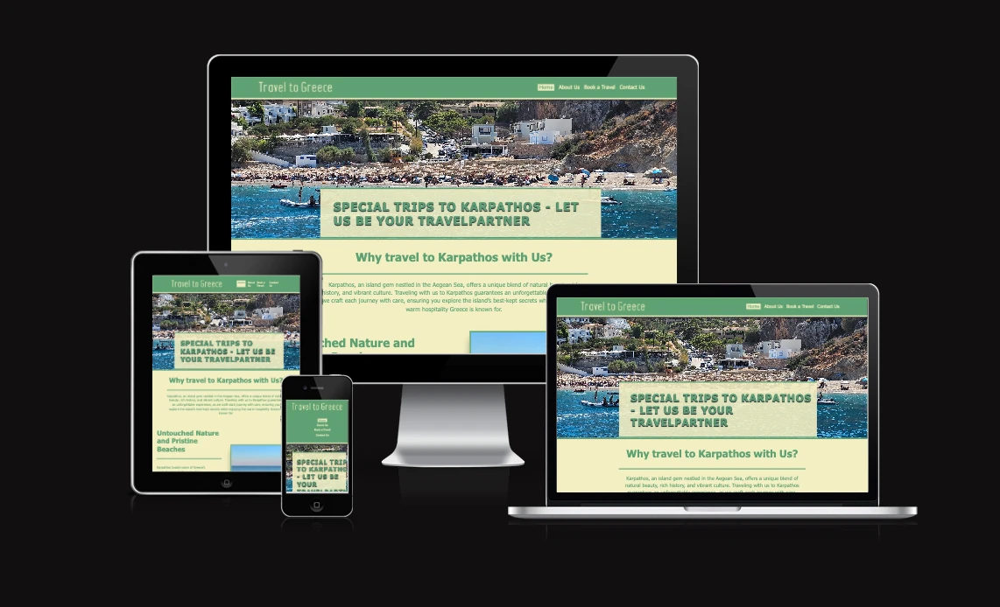

## FEATURES

+ ** Navigation **
  
  + Featured at the top of all pages.
  + A logo is featured to the left at the navigation and have a link to the home page.
  + To the right there is a couple of links, Home, About Us, Book a Travel and Contact Us, that is linked to the other pages at the site.
  + It is easy to navigate, the navigation bar is always visible at the top of the page.

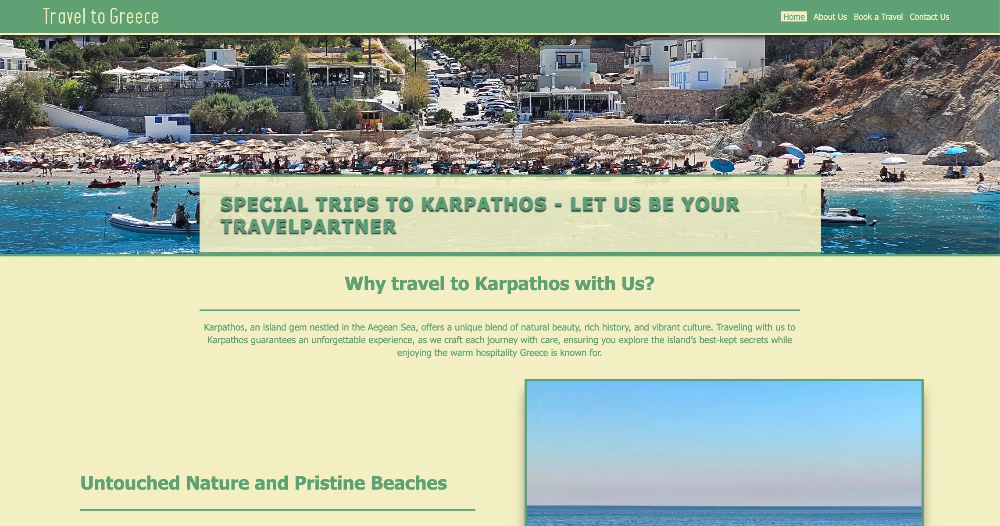

+ **Main home page**

  + There is pictures and text. The text describes about Karpathos, an Island in Greece, and all of the pictures is from Karpathos.

  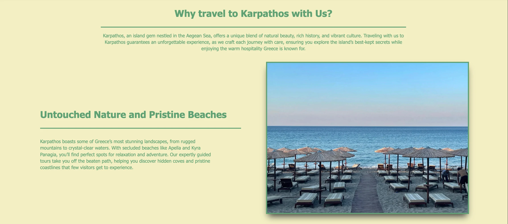

  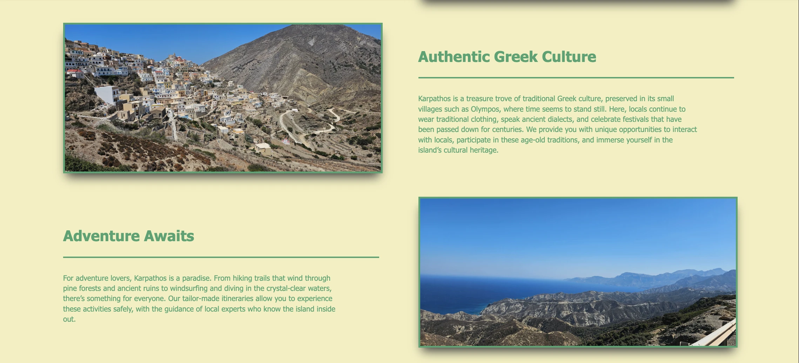

  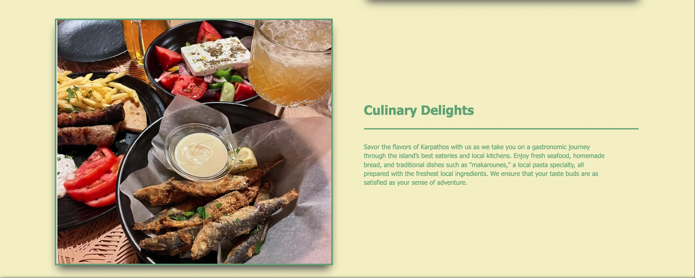

+ **The Footer**

  +The footer has linkes to Facebook and Twitter (X) and Copyright notice.
  +The footer is visible on all pages on the site.

  

+ **The About Us page**

  + At this page the company, Travel to Greece, is informing all visitors who they are and what they can offer for services.

  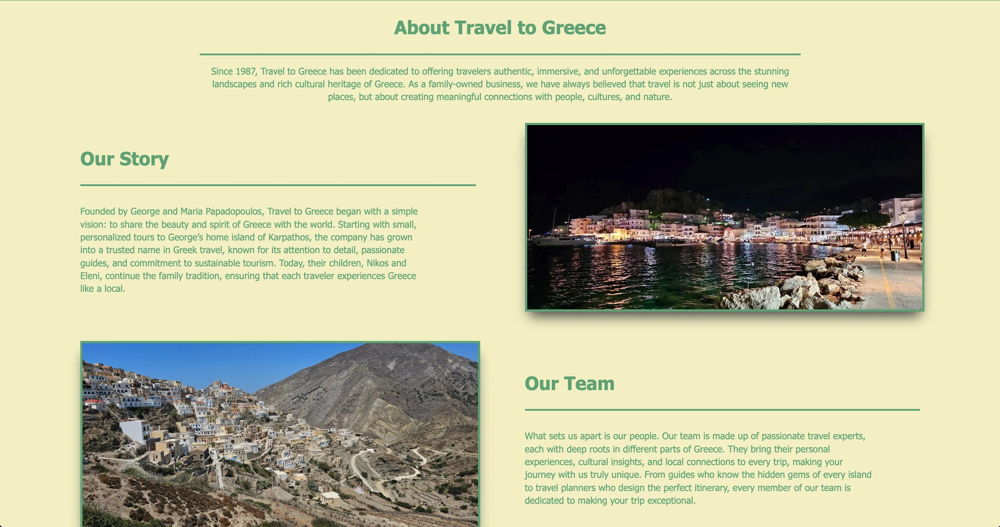
  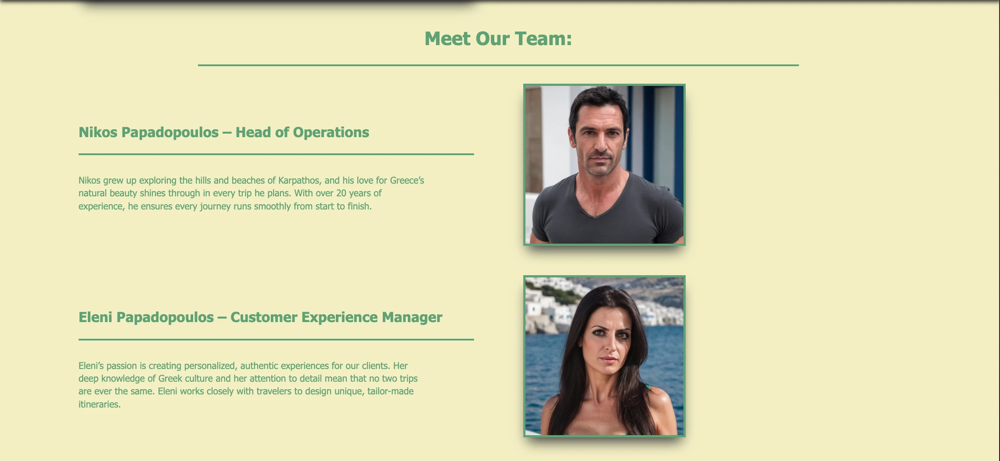
  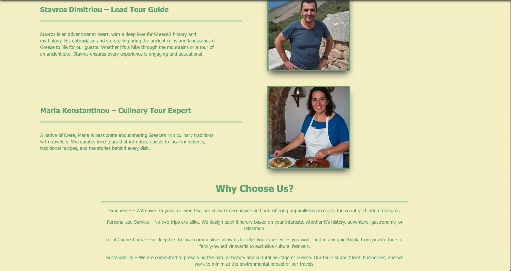
  

+ **The Booking Page**

  + At this page you can book a travel to one of three locations in Greece. All of them are Islands.
  + This form redirect to a success page.

  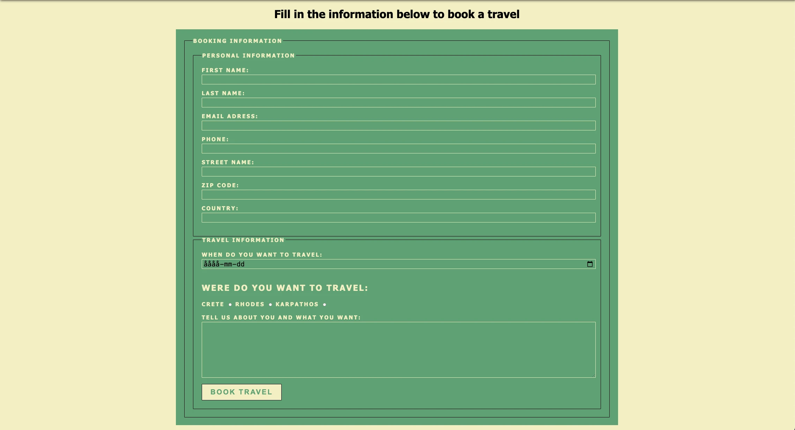

+ **The contact page**

  + This contact page has a google map to display the location in Karpathos. Becaous the company does not exist this is the lovation to the airport at Karpathos.
  + There is also a adress, and this is also a fake adress becous the company does not exist.
  + There is a contact form that redirect to a success page.

  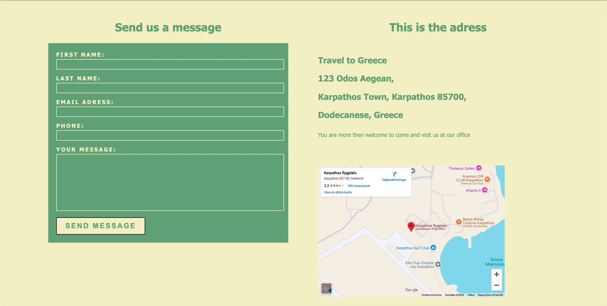

+ **Testing**

  + I have testes the this page works in different browsers like, Chrome, Firefox, Safari.
  + I have tested the page and confirmed the it is responsive. That the site looks over all good and all functions working att all standard screen sizes
    using devtool device tollbar.
  + I have confirmed that the forms on the site is working as they should and was intended to work.

+ **Validator testing**

  + HTML
    + No error or warnings was returned when passing through the official W3C validator.
  + CSS
    + No errors were found when passing through the official (Jigsaw) validator.
  + Accessibility
    + I confirmed that the colors and fonts chosen are easy to read and accessible by running it through Lighthouse in devtools.

    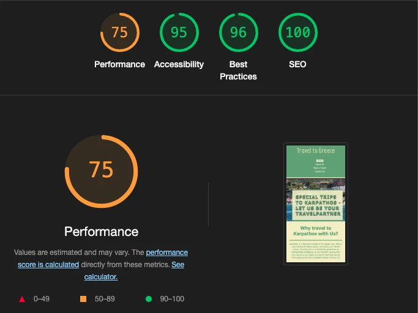
  
+ **Unfixed bugs**
  + There is no unfixed bugs. Only some layout issues with the forms on smaller screens.

+ **Deployment**

  + The site was deployed to GitHub pages. The steps are as follows:
    + In the Github repository, go to settings.
    + Click on Pages-link on the menu to the left.
    + From the source section drop down list, select the main branch and save.
    + Then I got a link to my page on Github.

    Here is the live link to the site - [Travel to Greece](https://creanorcode.github.io/project_1/index.html) 

+ **Credits**

  + Content
    + All icons are from [Font Awesome](https://fontawesome.com/)

  + Media
    + All images from Karpathos have been taken by me.
    + The portrait is fake and made by [Openart free](https://openart.ai/create?ai_model=epinikion%2FepiCRealism)

